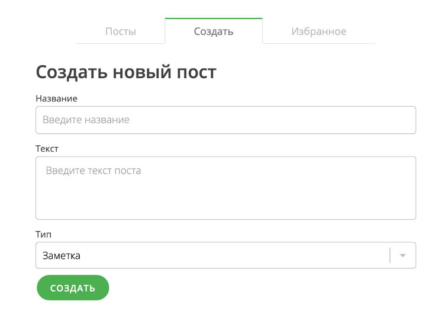
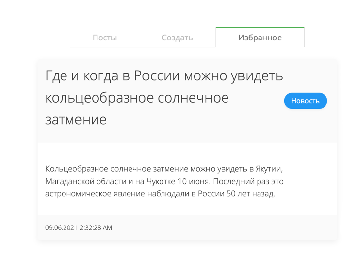
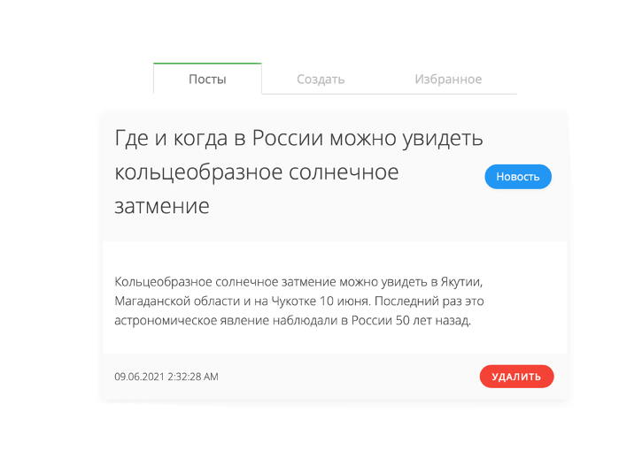

# JS pure post generator #
Приложение представляет собой генератор постов с возможностью добавлять в избранное, так же удалять из избранного и просматривать их.
Данные предоставляются Firebase через API. Приложение разработано на основе компонентного подхода, где каждый элемент представляет собой отдельный компонент со своим жизненным циклом и конструктором. Все компоненты наследуются от базового компонента Component.
***

Интерфейс приложения: создание поста

Интерфейс приложения: избранное

Интерфейс приложения: раздел постов

***
https://dictionary-db-717c4.web.app